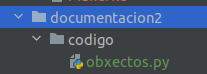
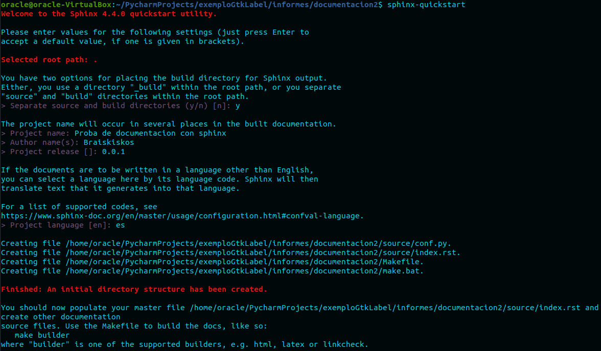
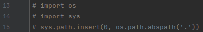
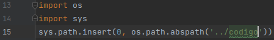
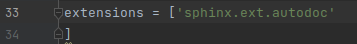
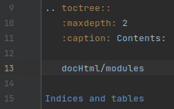
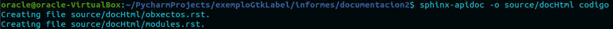

# Documentación sphinx

Para instalar sphinx:
```$ sudo pip install -U sphinx```

Crear carpeta donde vamos a trabajar dentro del proyecto, mi caso documentacion2.
Dentro crear carpeta codigo donde meteremos el código que queremos que nos cree un
documento que contenga toda la documentación.

Queda algo asi:



Ahora abrir terminal y situarse en esa carpeta de documentacion2.

Una vez situado ejecutar el siguiente comando **dentro**: ```$ sphinx-quickstart```

Rellenaremos los apartados que aparecen a continuación:



Creará las siguientes carpetas y documentos en documentacion2.


Entraremos en conf.py y modificaremos lo siguiente.

|ANTES |DESPUÉS|
|---|---|
|||
|||

Ahora dentro de source crearemos la carpeta docHtml.
Abriremos el index.rst y pondremos lo siguiente dentro:



Ejecutaremos el siguiente comando:



Ahora asegurate que tienes bien documentado obxectos.py y pon el siguiente comando:
`$ make html`

Esto creará un html dentro de build/html/docHtml/index.html donde al abrirlo en un
navegador podremos ver la documentación del código de un archivo o un proyecto.

# **FIN.**
